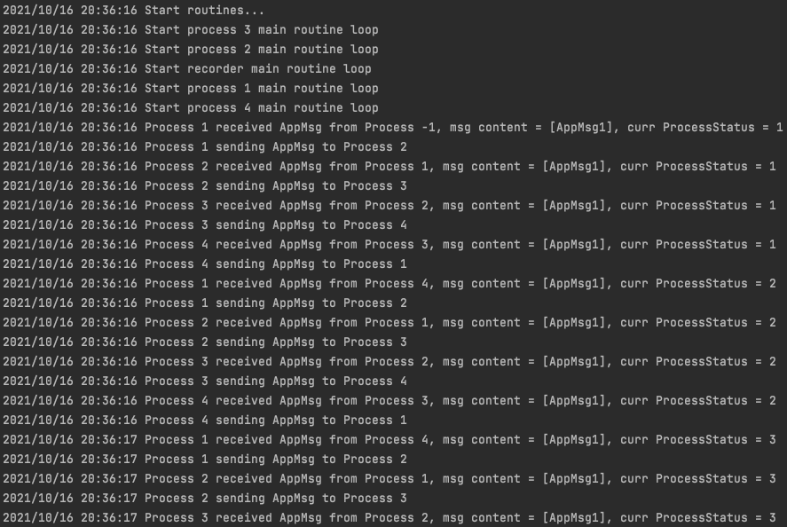

# 快照算法

## 实现思路

在征得助教同意后，本题目采取go语言，使用多线程的方式模拟多个进程，由于多线程与多进程在本题目中仅在传输消息的方式上有区别，所以可以认为对算法本身没有影响。

### 程序最终实现效果

本程序能够模拟**不限个数**的多个进程之间进行消息轮转时，进行快照算法。

快照算法可以**同时并行地**进行**多轮**，且每次执行算法之间不会受到影响。

用户可以自己定义哪个进程，何时在何种条件下，启动快照算法。

用户可以指定程序之间轮转的消息内容，并且可以是**多个**消息。

最终的实现将题目中的要求扩展为更加通用，更加泛化的快照算法实现。

以下是用户启动的方式：

```go
// 使用SetConf进行配置。
SetConf(&SnapshotAppConf{
	 // AppMsgs 指定了程序传送哪些消息，是一个切片，程序间可以传输多个消息。按照题干，这里应该是1个消息。
   AppMsgs:                           []AppMsg{"AppMsg1"},
	 // AppProcessMainLoopIntervalBetween 决定了程序运行的快慢，必须传入一个range，决定了进程主循环中，每次sleep的区间。
   AppProcessMainLoopIntervalBetween: []time.Duration{5 * time.Millisecond, 10 * time.Millisecond},
})

// 调用StartRoutines启动多个进程，以及快照进程。
// 参数1：给定需要启动的进程ID，如本例中的[]ProcessID{1, 2, 3, 4}
// 参数2：给定一个何时何情况下启动快照算法的函数。在本例中，设置为当进程1的状态数为101或201时，启动一次快照算法。
// 参数3：指定由哪个进程发送最初始的消息。本例中设置为1号进程。
StartRoutines([]ProcessID{1, 2, 3, 4}, func(pid ProcessID, status ProcessStatus) bool {
   if pid == 1 && (status == 101 || status == 201) {
      return true
   }
   return false
}, 1)
```

#### 运行结果

程序启动时，分别启动4个App进程，启动一个快照记录者进程。随后可以看到1号进程首先发送消息（假定从一个不存在的进程收到了一个消息），每个进程在不断地轮转消息，并打印出了每次收到消息的消息类型，以及消息内容，以及收到后的进程状态数。



以下给出了快照算法启动时的日志，在内部添加了说明文字。

``` 
// 此时进程4刚刚收到从进程3来的AppMsg，且自己的进程状态为100
2021/10/16 20:36:23 Process 4 received AppMsg from Process 3, msg content = [AppMsg1], curr ProcessStatus = 100
// 随后进程4将该消息转发给了进程1。
2021/10/16 20:36:23 Process 4 sending AppMsg to Process 1
// 则此时进程1收到了来自进程4的消息，并发现自己的状态数为101，于是启动了快照算法。
2021/10/16 20:36:23 Process 1 received AppMsg from Process 4, msg content = [AppMsg1], curr ProcessStatus = 101
// 进程1在启动前也完成了转发消息的职责。
2021/10/16 20:36:23 Process 1 sending AppMsg to Process 2
// 进程1此时开启快照算法。
2021/10/16 20:36:23 Process 1 Start snapshot, current processStatus = 101
// 进程1此时首次收到了MarkerMsg，算法使得启动快照算法的进程从匿名进程收到MarkerMsg。
// 其值为1，在本算法中，MarkerMsg的值表示当前的快照轮次ID。
2021/10/16 20:36:23 Process 1 received first MarkerMsg 1
// 进程1首次收到MarkerMsg后，直接将进程状态号发送给了快照记录进程，当前的状态号为101。
2021/10/16 20:36:23 Process 1 sending ProcessStatus 101
// 进程3此时收到了由进程1转发的MarkerMsg。
2021/10/16 20:36:23 Process 3 received MarkerMsg 1 from Process 1
// 进程3判断这是第一次收到MarkerMsg
2021/10/16 20:36:23 Process 3 received first MarkerMsg 1
// 于是进程3将线程状态号也发送给了快照记录进程，当前状态号为100。
2021/10/16 20:36:23 Process 3 sending ProcessStatus 100
// 进程3同时还停止记录从进程1到进程3的通道消息。也将该记录的值（空的数组）发送给了快照记录进程。
2021/10/16 20:36:23 Process 3 stop recording from Process 1, RecordedValues = []
// 进程2此时收到了从进程3传来的MarkerMsg。则与进程3的处理类似，这里略过。
2021/10/16 20:36:23 Process 2 received MarkerMsg 1 from Process 3
2021/10/16 20:36:23 Process 2 received first MarkerMsg 1
// 每次当进程首次收到MarkerMsg时，将自己的状态号发送给快照记录进程。
2021/10/16 20:36:23 Process 2 sending ProcessStatus 100
2021/10/16 20:36:23 Process 4 received MarkerMsg 1 from Process 1
2021/10/16 20:36:23 Process 2 stop recording from Process 3, RecordedValues = []
2021/10/16 20:36:23 Process 4 received first MarkerMsg 1
2021/10/16 20:36:23 Process 4 sending ProcessStatus 100
2021/10/16 20:36:23 Process 4 stop recording from Process 1, RecordedValues = []
2021/10/16 20:36:23 Process 3 received MarkerMsg 1 from Process 4
2021/10/16 20:36:23 Process 3 stop recording from Process 4, RecordedValues = []
// 可以看到当快照算法的进行过程中，进程2同样能够收到AppMsg，表示快照算法并不会阻塞进程的正常运行。
2021/10/16 20:36:23 Process 2 received AppMsg from Process 1, msg content = [AppMsg1], curr ProcessStatus = 101
2021/10/16 20:36:23 Process 2 sending AppMsg to Process 3
2021/10/16 20:36:23 Process 2 received MarkerMsg 1 from Process 1
// 进程2此时收到了进程1发送的MarkerMsg，这时它停止了记录这条通道上的信息，发现此时有记录一条AppMsg1的消息。并将这个通道记录的信息发送给快照记录进程。
2021/10/16 20:36:23 Process 2 stop recording from Process 1, RecordedValues = [AppMsg1]
2021/10/16 20:36:23 Process 4 received MarkerMsg 1 from Process 2
2021/10/16 20:36:23 Process 4 stop recording from Process 2, RecordedValues = []
2021/10/16 20:36:23 Process 4 received MarkerMsg 1 from Process 3
2021/10/16 20:36:23 Process 4 stop recording from Process 3, RecordedValues = []
2021/10/16 20:36:24 Process 3 received MarkerMsg 1 from Process 2
2021/10/16 20:36:24 Process 3 stop recording from Process 2, RecordedValues = []
2021/10/16 20:36:24 Process 1 received MarkerMsg 1 from Process 2
2021/10/16 20:36:24 Process 1 stop recording from Process 2, RecordedValues = []
2021/10/16 20:36:24 Process 2 received MarkerMsg 1 from Process 4
2021/10/16 20:36:24 Process 2 stop recording from Process 4, RecordedValues = []
2021/10/16 20:36:24 Process 1 received MarkerMsg 1 from Process 3
2021/10/16 20:36:24 Process 1 stop recording from Process 3, RecordedValues = []
2021/10/16 20:36:24 Process 1 received MarkerMsg 1 from Process 4
2021/10/16 20:36:24 Process 1 stop recording from Process 4, RecordedValues = []
2021/10/16 20:36:24 Process 3 received AppMsg from Process 2, msg content = [AppMsg1], curr ProcessStatus = 101
2021/10/16 20:36:24 Process 3 sending AppMsg to Process 4
2021/10/16 20:36:24 Process 4 received AppMsg from Process 3, msg content = [AppMsg1], curr ProcessStatus = 101
2021/10/16 20:36:24 Process 4 sending AppMsg to Process 1
2021/10/16 20:36:24 Process 1 received AppMsg from Process 4, msg content = [AppMsg1], curr ProcessStatus = 102
2021/10/16 20:36:24 Process 1 sending AppMsg to Process 2
// 此时快照记录进程检测到所有的进程都已经终止了记录通道上的消息，并且已经发送了自己的状态。开始打印记录的快照信息。
2021/10/16 20:36:24 Start print epoch 1 snapshot...
// 首先打印出进程1的信息：
2021/10/16 20:36:24 processID = [1]
// 进程1状态码为101
2021/10/16 20:36:24 processStatus = [101]
// 接下来打印每个其他进程到进程1的通道上的消息：
2021/10/16 20:36:24 process's recordMsgs from each chan...
// C21代表从进程2到进程1的信息通道，消息为空。
2021/10/16 20:36:24 process's record from chan [C21]: []
2021/10/16 20:36:24 process's record from chan [C31]: []
2021/10/16 20:36:24 process's record from chan [C41]: []
2021/10/16 20:36:24 processID = [2]
// 进程2状态码为100
2021/10/16 20:36:24 processStatus = [100]
2021/10/16 20:36:24 process's recordMsgs from each chan...
2021/10/16 20:36:24 process's record from chan [C32]: []
// 可以看到，进程1到进程2的通道上有一个AppMsg
2021/10/16 20:36:24 process's record from chan [C12]: [AppMsg1]
2021/10/16 20:36:24 process's record from chan [C42]: []
2021/10/16 20:36:24 processID = [3]
// 进程3状态码为100
2021/10/16 20:36:24 processStatus = [100]
2021/10/16 20:36:24 process's recordMsgs from each chan...
2021/10/16 20:36:24 process's record from chan [C13]: []
2021/10/16 20:36:24 process's record from chan [C43]: []
2021/10/16 20:36:24 process's record from chan [C23]: []
2021/10/16 20:36:24 processID = [4]
// 进程4状态码为100
2021/10/16 20:36:24 processStatus = [100]
2021/10/16 20:36:24 process's recordMsgs from each chan...
2021/10/16 20:36:24 process's record from chan [C34]: []
2021/10/16 20:36:24 process's record from chan [C14]: []
2021/10/16 20:36:24 process's record from chan [C24]: []
// 打印快照结束
2021/10/16 20:36:24 finished print epoch 1 snapshot...
2021/10/16 20:36:24 Process 2 received AppMsg from Process 1, msg content = [AppMsg1], curr ProcessStatus = 102
2021/10/16 20:36:24 Process 2 sending AppMsg to Process 3
2021/10/16 20:36:24 Process 3 received AppMsg from Process 2, msg content = [AppMsg1], curr ProcessStatus = 102
2021/10/16 20:36:24 Process 3 sending AppMsg to Process 4
```

可以看出，最终记录的状态为，进程1为101，进程2为100，进程3为100，进程4为100。而进程1到进程2的通道上有一个AppMsg。由于进程转发消息的顺序是1到4，所以这是一个一致的状态。


### 关键数据结构定义

首先针对本算法实现中用到的数据结构和数据类型进行说明：

1. Epoch

``` go
type Epoch int
```

Epoch，int型，表示全局唯一的一次快照ID。

2. MarkerMsg

```go
type MarkerMsg int
```

定义MarkerMsg为int，与Epoch存在一一对应的关系。

3. ChanMsg

```go
type ChanMsg interface {
   String() string
}
```

ChanMsg 定义程序间通用的消息传递对象。

4. AppMsg

```go
type AppMsg string // Can be anything
```

AppMsg为程序之间传递的应用级消息，可以是任意值（如interface{}），这里用string代替。

5. FromChanMsgWithName & ToChanMsgWithName

```go
type FromChanMsgWithName struct {
   C    <-chan ChanMsg
   Name string
}

type ToChanMsgWithName struct {
	C    chan<- ChanMsg
	Name string
}
```

FromChanMsgWithName，ToChanMsgWithName分别为单向命名通道的实现。

FromChanMsgWithName通道的使用者只能够接受消息。

ToChanMsgWithName通道的使用者只能够发送消息。

6. RecorderMsg

```go
type RecorderMsg struct {
   Epoch     Epoch
   Source    RecorderMsgSource
   ProcessID ProcessID

   // For Source == SourceProcess
   ProcessStatus ProcessStatus

   // For Source == SourceChan
   ChanName       string
   RecordedValues []AppMsg
}
```

表示快照记录进程收到的消息结构体。

- Epoch表示快照轮次ID
- Source表示这个数据的来源，若来源为Process，则表示进程的状态信息，若为通道，则表示从通道上记录的信息。
- ProcessID 表示数据来源的进程号。
- ProcessStatus表示当来源为Process时，记录的进程码。
- ChanName表示当来源为通道时，该通道的名称。
- RecordedValues表示当来源为通道时，其通道上记录的消息。

7. ChanPair

```go
type ChanPair struct {
   ProcessID ProcessID            // 目标进程号
   FromChan  *FromChanMsgWithName // 从该目标进程到本进程的通道
   ToChan    *ToChanMsgWithName   // 从本进程到目标进程的通道
}
```

ChanPair是针对每个进程提供的一组进出通道。

- ProcessID表示这个通道的目标进程
- FromChan表示从该目标进程到本进程的通道
- ToChan从本进程到目标进程的通道

8. AppProcess

```go
type AppProcess struct {
   ctx                 context.Context
   processStatus       ProcessStatus
   selfProcessID       ProcessID
   chanPairs           map[ProcessID]*ChanPair
   recorderChan        chan *RecorderMsg
   shouldStartSnapshot func(processID ProcessID, processStatus ProcessStatus) bool
}
```

AppProcess结构体定义了应用进程的内部数据。

- ctx进程上下文。
- processStatus，定义了该进程的状态码。
- selfProcessID表示自己的进程ID
- chanPairs表示从该进程到其他进程的数据通道。
- recorderChan表示从该进程到快照记录进程的数据通道。
- shouldStartSnapshot存储何时在何种条件下启动快照算法的判断条件。


### 关键执行过程描述

#### App进程的执行主循环

在代码内部，详细给出了执行说明。

```go
func (a *AppProcess) start() {
   log.Printf("Start process %d main routine loop", a.selfProcessID)
   // 获取与快照算法相关的帮助函数。
   dealWithMarkerMsgIncoming, addRecordMsgIfNecessary := a.genMarkerMsgUtil()
   // 启动主循环。
   for {
      // 对其他每个线程进行消息监听循环。
      for fromProcessID, chanPair := range a.chanPairs {
         select {
         // 若收到了从某个线程发来的消息。
         case m := <-chanPair.FromChan.C:
           	// 甄别该消息的类型
            switch m.(type) {
            // 如果是MarkerMsg，则启动快照相关处理。
            case MarkerMsg:
               log.Printf("Process %d received MarkerMsg %+v from Process %d", a.selfProcessID, m.(MarkerMsg), fromProcessID)
               // 使用指定方法处理这个MarkerMsg
               dealWithMarkerMsgIncoming(m.(MarkerMsg), fromProcessID)
            case AppMsg:
               // 如果是应用消息
               // 如果当前正在快照算法中，并且在记录这条通道上的消息，则将这条消息添加到记录中。
               addRecordMsgIfNecessary(chanPair.FromChan.Name, m.(AppMsg))
               // 增加状态码
               a.processStatus++
               log.Printf("Process %d received AppMsg from Process %d, msg content = [%+v], curr ProcessStatus = %d", a.selfProcessID, fromProcessID, m.(AppMsg), a.processStatus)
               // 获取将要把消息传递给的下一个进程ID
               nextProcessID := a.getNextProcessID()
               log.Printf("Process %d sending AppMsg to Process %d", a.selfProcessID, nextProcessID)
               // 获取针对下一个进程ID的消息通道。
               nextChanPair := a.chanPairs[nextProcessID]
               // 发送该消息。
               nextChanPair.ToChan.C <- m
               // 判断用户给定的条件是否满足，是否要启动快照算法。
               if a.shouldStartSnapshot(a.selfProcessID, ProcessStatus(a.processStatus)) {
                  log.Printf("Process %d Start snapshot, current processStatus = %d", a.selfProcessID, a.processStatus)
                 	// 生成一个新的快照轮次ID
                  epoch := genNewSnapshotEpoch()
                  markerMsg := getMarkerMsgByEpoch(epoch)
                  // 认为从一个不存在的通道上接收到了一个标记，这里采取了admin进程作为该进程号
                  dealWithMarkerMsgIncoming(markerMsg, adminPid)
               }
            default:
               log.Fatalf("process %d received invalid msg = [%+v]", a.selfProcessID, m)
            }
         case <-a.ctx.Done():
            // 优雅关停
            log.Printf("process %d shutdown.", a.selfProcessID)
            return
         default:
            // 没收到消息直接访问下一个fromChan。
            lower := Conf.AppProcessMainLoopIntervalBetween[0]
            upper := Conf.AppProcessMainLoopIntervalBetween[1]
            s := rand.Intn(int(upper-lower)) + int(lower)
            // 根据配置里的数据，休息一小段时间。用于控制进程运行速度。
            time.Sleep(time.Duration(s))
            continue
         }
      }
   }
}
```

以上给出了应用进程的主循环，总地来说，就是在不停地监听每个进程发来消息的通道，直到某个通道收到消息时，再执行相应的代码。

其中最关键的与MarkerMsg处理相关的内容在下面给出。

#### MarkerMsg处理逻辑

在代码内部，详细给出了执行说明。

```go
func (a *AppProcess) genMarkerMsgUtil() (func(markerMsg MarkerMsg, fromProcessID ProcessID), func(fromChanName string, msg AppMsg)) {
   // 定义一些函数内部使用的数据类型。
   type recordStatus struct {
      ProcessID      ProcessID
      Recording      bool
      FromChanName   string
      RecordedValues []AppMsg
   }
   type pid2recordStatus map[ProcessID]*recordStatus // processID2IsRecording
   type epoch2recordStatus map[Epoch]pid2recordStatus
   // 使用闭包。在这里生成了map存储结构。在函数内部定义了对于每个快照执行过程中，其记录的针对每个通道的数据信息。
   recordStatusForAllEpochs := make(epoch2recordStatus)
   // 判断是否是一个新的MarkerMsg的工具函数。
   isNewMarkerMsg := func(markerMsg MarkerMsg) bool {
      _, ok := recordStatusForAllEpochs[getEpochByMarker(markerMsg)]
      return !ok
   }
   // 初始化针对某个MarkerMsg的进程记录信息的工具函数。
   initRecordStatus := func(markerMsg MarkerMsg) {
      s := make(pid2recordStatus)
      recordStatusForAllEpochs[getEpochByMarker(markerMsg)] = s
      for _, chanPair := range a.chanPairs {
         pid := chanPair.ProcessID
         s[pid] = &recordStatus{
            ProcessID:      pid,
            FromChanName:   chanPair.FromChan.Name,
            Recording:      true,
            RecordedValues: make([]AppMsg, 0),
         }
      }
   }
   // 每个进程处理到来的MarkerMsg的主要过程
   dealWithMarkerMsgIncoming := func(markerMsg MarkerMsg, fromProcessID ProcessID) {
      // 这个内部函数定义了过程，它会停止记录某个进程的通道信息，并将该通道上记录的信息发送给快照记录进程的工具函数。
      stopRecordingSendValues := func(pid ProcessID) {
         rs := recordStatusForAllEpochs[getEpochByMarker(markerMsg)]
         s := rs[pid]
         // 这里设置为false，即可判断该通道停止记录。
         s.Recording = false
         log.Printf("Process %d stop recording from Process %d, RecordedValues = %+v", a.selfProcessID, pid, s.RecordedValues)
         a.recorderChan <- &RecorderMsg{
            Epoch: getEpochByMarker(markerMsg),
            Source:         SourceChan,
            ProcessID:      a.selfProcessID,
            ChanName:       s.FromChanName,
            RecordedValues: s.RecordedValues,
         }
      }
      // 关键：这里是快照算法的核心。
      // 首先判断是否是一个最新的MarkerMsg
      if isNewMarkerMsg(markerMsg) {
         // 第一次收到MarkerMsg，首先将自己的进程信息记录，随后向所有其他进程发送MarkerMsg
         log.Printf("Process %d received first MarkerMsg %v", a.selfProcessID, markerMsg)
         // 首先初始化记录的数据结构
         initRecordStatus(markerMsg)
         log.Printf("Process %d sending ProcessStatus %d", a.selfProcessID, a.processStatus)
         // 随即将自己的状态号信息传输给快照记录进程。
         a.recorderChan <- &RecorderMsg{
            Epoch: getEpochByMarker(markerMsg),
            Source:        SourceProcess,
            ProcessID:     a.selfProcessID,
            ProcessStatus: a.processStatus,
         }
         // adminPid代表管理员进程号，在这里表示为由匿名进程收到MarkerMsg。
         // 如果从adminPid收到MarkerMsg，则代表当前进程是启动快照算法的进程。
         // 如果不是，则表示从某个应用进程收到MarkerMsg。
         if fromProcessID != adminPid {
            // 在这时，将停止记录从fromProcessID到来的通道，并将已经记录的信息传输给快照记录信息。
            stopRecordingSendValues(fromProcessID)
         }
         // 随后，向其他全部的进程广播MarkerMsg。
         for _, chanPair := range a.chanPairs {
            if chanPair.ProcessID == adminPid {
               continue
            }
            chanPair.ToChan.C <- markerMsg
         }
      } else {
         // 不是第一次收到marker msg，则将此次的发信者记录停止，并将内容发送至记录者手中。
         stopRecordingSendValues(fromProcessID)
      }
   }
   // 定义工具函数：如果当前进程处于记录这条通道上消息的状态，则将来到的信息记录到数据结构中。
   addRecordMsgIfNecessary := func(fromChanName string, msg AppMsg) {
      for _, rs := range recordStatusForAllEpochs {
         for _, ir := range rs {
            if ir.FromChanName == fromChanName && ir.Recording {
               ir.RecordedValues = append(ir.RecordedValues, msg)
            }
         }
      }
   }
   return dealWithMarkerMsgIncoming, addRecordMsgIfNecessary
}
```

其中，快照算法的核心在以上伪代码的第51到81行。其中是处理MarkerMsg的到来的核心逻辑。

#### 启动的方法

在代码内部，详细给出了执行说明。

```go
func StartRoutines(pids []ProcessID, shouldStartSnapshot func(pid ProcessID, status ProcessStatus) bool, kickerPID ProcessID) {
   // 生成到快照记录进程的数据通道。
   recorderChan := NewRecorderMsgChan()
   // 初始化存储各个通道的哈希表。
   fromChans := make(map[ProcessID]map[ProcessID]*FromChanMsgWithName)
   toChans := make(map[ProcessID]map[ProcessID]*ToChanMsgWithName)
   adminChans := make(map[ProcessID]*DualChanMsgWithName)
   for _, pid := range pids {
      fromChans[pid] = make(map[ProcessID]*FromChanMsgWithName)
      toChans[pid] = make(map[ProcessID]*ToChanMsgWithName)
   }
   // 为每个进程生成，对应的通道。
   for i := 0; i < len(pids); i++ {
      pid := pids[i]
      for j := i; j < len(pids); j++ {
         // 为从pid到otherPID之间的信息传输生成双向通道。
         otherPID := pids[j]
         if pid != otherPID {
            cij := NewMsgChan()
            cji := NewMsgChan()
						
            // 定义otherPID到pid的通道名。
            cjiName := fmt.Sprintf("C%d%d", otherPID, pid)
            fromChans[pid][otherPID] = NewFromChanMsgWithName(cjiName, cji)
            toChans[otherPID][pid] = NewToChanMsgWithName(cjiName, cji)

            cijName := fmt.Sprintf("C%d%d", pid, otherPID)
            fromChans[otherPID][pid] = NewFromChanMsgWithName(cijName, cij)
            toChans[pid][otherPID] = NewToChanMsgWithName(cijName, cij)
         } else {
            c := NewMsgChan()
            adminDualChan := NewDualChanMsgWithName(fmt.Sprintf("admin_%d", pid), c)
            adminChans[pid] = adminDualChan
         }
      }
   }

   ctx, cancel := context.WithCancel(context.Background())
   // 在这里启动了快照记录进程。
   go NewSnapshotRecorderProcess(ctx, len(pids), recorderChan).Start()
   // 定义每个进程到其他进程的通道数据结构。
   pid2ChanPairs := make(map[ProcessID]map[ProcessID]*ChanPair)
   for _, pid := range pids {
      cps := make(map[ProcessID]*ChanPair)
      for _, otherPid := range pids {
         if otherPid != pid {
            cps[otherPid] = NewChanPair(otherPid, fromChans[pid][otherPid], toChans[pid][otherPid])
         } else {
            // admin process
            cps[adminPid] = NewChanPair(adminPid, adminChans[pid].from, adminChans[pid].to)
         }
      }
      pid2ChanPairs[pid] = cps
   }
   for pid, cps := range pid2ChanPairs {
      // 启动每个应用进程，传入对应的到其他进程的通道。
      go NewAppProcess(ctx, pid, cps, recorderChan, shouldStartSnapshot).start()
   }
   // 从admin线程，向启动线程发送初始的信息。这里使用了配置中定义的信息。
   for _, msg := range Conf.AppMsgs {
      adminChans[kickerPID].to.C <- msg
   }
   // 等到执行60秒后，终止进程。
   time.Sleep(60 * time.Second)
   cancel()
}
```

剩余代码大多与算法关系不大，不在文档中进行详细解释。